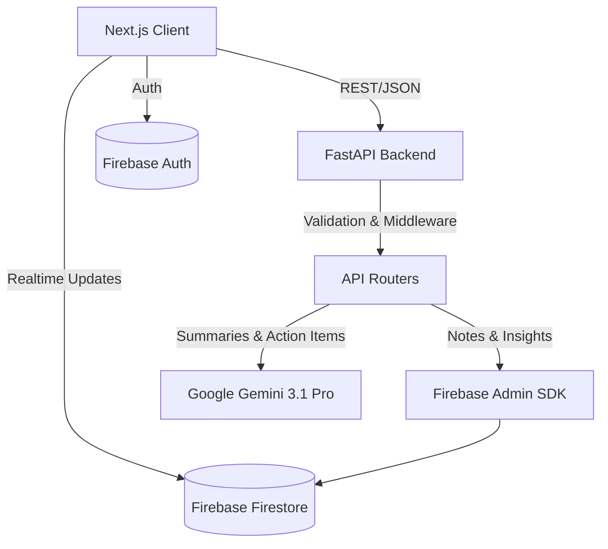

# Peblo 

> AI-powered engine , elegant note-taking workspace.

Peblo Notes is a sophisticated, full-stack application designed to elevate your note-taking experience. It seamlessly blends a premium, distraction-free aesthetic with powerful AI capabilities, allowing you to not just write, but to understand, organize, and share your thoughts effortlessly.

## Architecture




## Tech Stack

| Domain | Technologies |
| :--- | :--- |
| **Frontend** | Next.js 15 (App Router), React 19, TypeScript, Tailwind CSS v4, Zustand, TipTap |
| **Backend** | Python, FastAPI, Pydantic, Uvicorn |
| **Database** | Firebase Firestore, Firebase Authentication |
| **AI Integration** | Google Gemini 3.1 Pro (High) |
| **Deployment** | Vercel (Frontend), Railway (Backend), GitHub Actions |

## Features

- **Rich Text Editor**: Distraction-free editing powered by TipTap with markdown shortcuts.
- **AI Sidebar**: Instantly generate intelligent summaries and extract action items using Gemini 3.1 Pro.
- **Real-time Sync**: Instant, optimistic UI updates synced to Firebase Firestore.
- **Public Sharing**: Generate beautifully formatted, read-only public links for your notes with one click.
- **Productivity Insights**: Visualize your writing habits with an integrated analytics dashboard.
- **Global Search**: Command palette (`Cmd+K`) for lightning-fast navigation and filtering.

### Bonus Features Implemented
- **Dark Mode Toggle**: Persistent dark/light mode with system preference detection.
- **Keyboard Shortcuts**: Robust keyboard-centric workflow (`Cmd+K`, `Cmd+S`, `Cmd+Shift+N`, `Cmd+/`, `?`).
- **Optimistic UI**: Snappy interface that immediately reflects changes before server confirmation.
- **Markdown Preview Toggle**: Easily switch between rich text editing and raw markdown preview with syntax highlighting.

## Getting Started

### Prerequisites
- Node.js 18+
- Python 3.10+
- A Firebase Project (with Firestore and Auth enabled)
- Google Gemini API Key

### Installation

**1. Clone the repository**
```bash
git clone https://github.com/your-username/peblo-notes.git
cd peblo-notes
```

**2. Setup Backend**
```bash
cd backend
python -m venv venv
source venv/bin/activate  # On Windows: venv\Scripts\activate
pip install -r requirements.txt
cp .env.example .env
# Edit .env with your credentials
uvicorn main:app --reload
```

**3. Setup Frontend**
```bash
cd ../frontend
npm install
cp .env.local.example .env.local
# Edit .env.local with your Firebase credentials
npm run dev
```

The application will be available at `http://localhost:3000`.

## Environment Variables

### Backend (`backend/.env`)

| Variable | Description | Where to get it |
| :--- | :--- | :--- |
| `GOOGLE_APPLICATION_CREDENTIALS` | Path to Firebase Admin SDK JSON key. | Firebase Console > Project Settings > Service Accounts |
| `GEMINI_API_KEY` | API Key for Google Gemini. | Google AI Studio |
| `FRONTEND_URL` | Allowed origin for CORS. | e.g., `http://localhost:3000` |

### Frontend (`frontend/.env.local`)

| Variable | Description | Where to get it |
| :--- | :--- | :--- |
| `NEXT_PUBLIC_FIREBASE_API_KEY` | Firebase Client API Key. | Firebase Console > Project Settings > General |
| `NEXT_PUBLIC_FIREBASE_AUTH_DOMAIN` | Firebase Auth Domain. | Firebase Console > Project Settings > General |
| `NEXT_PUBLIC_FIREBASE_PROJECT_ID` | Firebase Project ID. | Firebase Console > Project Settings > General |
| `NEXT_PUBLIC_FIREBASE_STORAGE_BUCKET`| Firebase Storage Bucket. | Firebase Console > Project Settings > General |
| `NEXT_PUBLIC_FIREBASE_MESSAGING_SENDER_ID`| Firebase Messaging Sender ID. | Firebase Console > Project Settings > General |
| `NEXT_PUBLIC_FIREBASE_APP_ID` | Firebase App ID. | Firebase Console > Project Settings > General |
| `NEXT_PUBLIC_API_URL` | URL of the FastAPI Backend. | e.g., `http://localhost:8000` |

## API Documentation

| Method | Endpoint | Description |
| :--- | :--- | :--- |
| `POST` | `/api/notes` | Create a new note |
| `GET` | `/api/notes/{id}` | Retrieve a specific note |
| `PUT` | `/api/notes/{id}` | Update an existing note |
| `DELETE`| `/api/notes/{id}` | Delete a note |
| `POST` | `/api/notes/{id}/archive` | Toggle archive status |
| `POST` | `/api/ai/summarize` | Generate AI summary & action items |
| `POST` | `/api/share/{note_id}` | Create or get a public share link |
| `GET` | `/api/share/{share_id}` | Retrieve public note data |
| `GET` | `/api/insights` | Get user analytics and activity |

## Firestore Schema

| Collection | Field | Type | Description |
| :--- | :--- | :--- | :--- |
| **notes** | `id` | String | Unique Note ID |
| | `user_id` | String | Owner's Firebase Auth UID |
| | `title` | String | Note title |
| | `content` | String | Note body (HTML) |
| | `tags` | Array | Assigned tags |
| | `category` | String | Note category |
| | `is_archived`| Boolean | Archive status |
| | `created_at` | Timestamp | Creation time |
| | `updated_at` | Timestamp | Last modified time |
| **shares** | `share_id` | String | Unique public share ID |
| | `note_id` | String | Reference to the original note |
| | `owner_id` | String | Owner's UID |
| | `view_count` | Number | Number of public views |

## AI Integration

Peblo Notes leverages **Google Gemini 3.1 Pro (High)** for unparalleled natural language understanding. 

**Prompt Design**: The AI is instructed via structured prompts to act as a concise, highly organized executive assistant. It receives the raw text of a note and returns a JSON object containing a brief `summary` and an array of `action_items`. This ensures consistent, parseable outputs that the frontend can stagger-animate into the UI seamlessly.

## Screenshots

*(Placeholders)*

| Dashboard | Editor with AI |
| :---: | :---: |
|  |  |

| Insights | Public Share |
| :---: | :---: |
|  |  |

## Demo Video
 (will be added soon)

## Trade-offs & Future Work

**Trade-offs made:**
- **Client-Side Sorting/Filtering**: To avoid complex composite index creation friction during setup, sorting and filtering of notes are currently handled primarily on the client side. This works exceptionally well for thousands of notes but might require server-side pagination for massive datasets.
- **TipTap vs Raw Markdown**: TipTap was chosen for a premium WYSIWYG experience, which means content is stored as HTML. The Markdown preview handles this adequately, but a native bi-directional Markdown-to-HTML pipeline would be more robust.

**Future Work:**
- **Collaborative Editing**: Implement Yjs with TipTap to allow real-time multiplayer editing on shared notes.
- **Vector Search**: Use Pinecone or pgvector to embed notes and allow semantic search ("find notes about my dog").
- **Offline Mode**: Enhance Zustand and Firebase persistence to allow full offline capability with conflict resolution.
